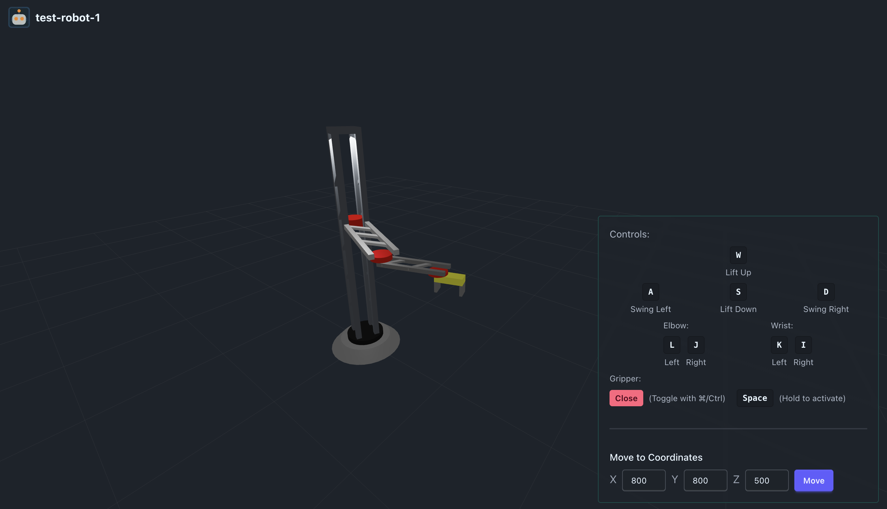

# Robotix



A very very simple virtual robotic system visualization and control platform built with Next.js and Rust. Robotix provides a basic web interface for simulating and controlling robotic arms, complete with real-time 3D visualization and inverse kinematics calculations that enable multiple users to view and control a robot.

## Project Overview

- **Frontend**: Next.js with Three.js for 3D visualization
- **Backend**: Rust server handling robotic calculations and control
- **Features**:
  - Real-time 3D visualization of robotic arms
  - Inverse kinematics calculations
  - Custom robot configuration support
  - Move-to-coordinates functionality
  - Joint-by-joint control

## Project Structure

```
.
├── client/          # Next.js frontend application
├── server/          # Rust backend server
     ├── config      # Files that enable you to configure your robots
├── assets/          # Static assets for the repo
└── Makefile         # Project automation scripts
```

## Prerequisites

- Node.js (v18 or higher)
- npm (v9 or higher)
- Rust (latest stable version)
- Cargo (Rust's package manager)

## Getting Started

The project includes a comprehensive Makefile to simplify setup and development. Here's how to get started:

1. **Initial Setup**
   ```bash
   make setup
   ```
   This will:
   - Install client dependencies
   - Set up the server environment
   - Build the Rust project
   - Install development tools

2. **Running the Application**
   ```bash
   make run
   ```
   This will start both the client and server in parallel:
   - Client: `http://localhost:3000`
   - Server: `http://localhost:8080`

### Alternative Commands

- Run client only: `make client.run`
- Run server only: `make server.run`
- View all available commands: `make help`

## Robot Configuration

Robotix supports custom robot configurations through TOML files. These files define:
- Robot dimensions
- Joint limits

### Using Custom Configurations

1. Place your robot configuration file in the `server/config` directory
2. The configuration should follow the standard format:
   ```toml
   # Robot Crane Configuration
id = "test-robot-1"

# Base dimensions (in meters)
[base]
height = 0.1
radius_bottom = 0.35
radius_top = 0.25
// etc...
   ```

3. The system will automatically load available configurations on startup

## Limitations

- **Move to Coordinates**: The inverse kinematics solver uses an optimization approach to reach target coordinates. When a point is unreachable:
  - The system will not error
  - Instead, it will move the robot to the closest achievable position
  - This behavior ensures smooth operation but may result in the robot not reaching the exact target position
  - Users should be aware of their robot's workspace limitations when planning movements

## Development

For development, the server includes auto-reload functionality when files change. The client supports hot-reloading for immediate feedback during development. It is recommended to use the Makefile targets

